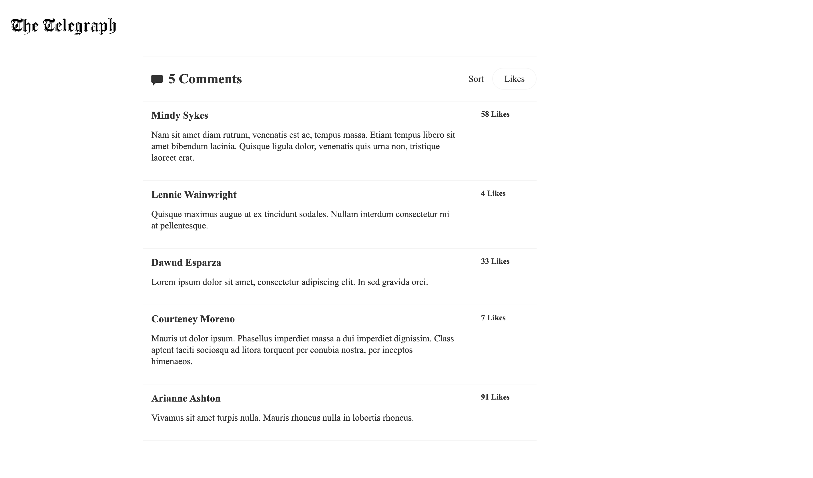
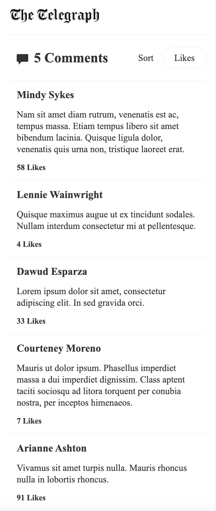

## :floppy_disk: Set up

Firstly, install all of the packages:

```sh
npm install
```

Then run the watcher:

```sh
npm run dev
```

Visit [http://localhost:3000/](http://localhost:3000/) in your web browser and you _should_ see the completed version of the page

Desktop View


Mobille View

